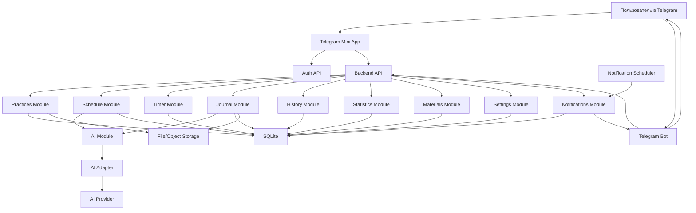

# ARCHITECTURE.md

# Архитектура Telegram Mini App "Дневник духовной практики"

Версия: 0.1  
Статус: проект архитектуры для согласования

---

# 1. Как я понимаю идею проекта

Проект — это Telegram Mini App для ежедневной духовной практики. Его главная задача не в том, чтобы быть ежедневником, CRM, Notion или календарём, а в том, чтобы стать простым ежедневным помощником практикующего.

Пользователь открывает приложение каждый день, видит практики на сегодня, запускает таймер, завершает практику, оставляет заметку, смотрит историю и статистику. Расписание может меняться каждый день, а список практик не должен быть фиксированным: пользователь сам создаёт, редактирует и развивает свою библиотеку.

Telegram используется только для трёх вещей:

- авторизация пользователя;
- запуск Mini App;
- отправка уведомлений через бота.

Вся основная логика, данные, расписание, дневник, история, статистика и библиотека практик должны находиться внутри собственного приложения.

AI является вспомогательным слоем: он помогает понять текст, голос, создать или изменить расписание, найти практику и ответить пользователю. При этом приложение должно полноценно работать без AI.

---

# 2. Главные архитектурные принципы

1. Модульность: каждая крупная функция живёт в отдельном модуле.
2. Независимость AI: бизнес-логика не зависит от конкретной модели и не ломается без AI.
3. Собственное хранение данных: никаких Notion, Google Calendar, Google Docs, сторонних todo-сервисов.
4. Telegram как оболочка входа и уведомлений, а не как место хранения логики.
5. Простота: не использовать сложные технологии, если простое решение покрывает задачу.
6. Расширяемость: проект должен спокойно развиваться годами без переписывания ядра.
7. Ссылки на материалы, а не копирование контента: хранить только URL из разрешённых источников.

---

# 3. Предлагаемая общая архитектура

Оптимальный вариант для MVP — модульный монолит с отдельным доменным слоем.

Это означает, что backend, bot и будущие клиенты находятся в одном репозитории, используют общие типы и доменную модель, но разделены по модулям. Такой подход проще микросервисов, быстрее для MVP и хорошо соответствует правилу "не усложнять проект без необходимости".

Высокоуровневые части:

- Telegram Mini App frontend;
- Backend API;
- Telegram Bot;
- Database;
- File/Object Storage для пользовательских изображений и голосовых файлов;
- AI Adapter;
- Notification Scheduler.

Backend является центром системы. Mini App обращается к нему через обычное API. Bot получает команды и отправляет уведомления. Scheduler планирует уведомления. AI Adapter подключается только там, где нужна обработка текста/голоса или помощник.

Domain Layer хранит главную бизнес-логику и правила предметной области. UI не работает с базой напрямую и не содержит бизнес-логики, а обращается к backend-сервисам, которые используют domain.

---

# 4. Предлагаемый стек технологий

## Основной рекомендуемый стек

Frontend:

- React;
- TypeScript;
- Vite;
- Telegram Mini Apps SDK;
- Zustand или TanStack Query для состояния и запросов;
- CSS Modules или Tailwind CSS после отдельного согласования дизайна.

Backend:

- Node.js;
- TypeScript;
- NestJS или Fastify.

Bot:

- grammY или Telegraf.

Database:

- SQLite for MVP;
- PostgreSQL later through the same repository interfaces.

ORM:

- Prisma или Drizzle ORM.

Storage:

- S3-compatible storage для изображений и голосовых файлов;
- для локальной разработки можно использовать файловое хранилище.

Standard static assets and user uploads должны опираться на единый storage abstraction, чтобы локальный запуск и серверный деплой использовали один и тот же контракт хранения.

AI:

- единый AI Adapter;
- OpenAI-compatible API как общий протокол;
- конкретный провайдер задаётся настройками.

Фоновые задачи:

- простая очередь задач на базе SQLite-backed scheduler для MVP;
- позже можно заменить на отдельный worker-backed вариант без изменения домена.

## Backend-agnostic API

Backend должен быть независим от Telegram как платформы клиента.

Это означает:

- Mini App является текущим клиентом, но не единственным по архитектуре;
- backend предоставляет обычное HTTP API;
- Telegram Bot и Mini App используют общие backend-сервисы;
- при необходимости позже можно добавить Web, Android или iOS без переписывания доменной логики.

Telegram в текущем проекте остаётся только интерфейсом доступа и каналом уведомлений.

Тестирование:

- Vitest для unit-тестов;
- Playwright для проверки Mini App UI;
- тесты API на уровне backend.

## Почему этот стек подходит

React + TypeScript хорошо подходит для Telegram Mini App: быстрый мобильный интерфейс, много готовых практик, понятная разработка компонентов.

Node.js + TypeScript позволяет использовать один язык для frontend, backend и bot. Это уменьшает сложность проекта и снижает риск расхождения моделей данных.

SQLite подходит для MVP, потому что позволяет быстро запустить проект без лишней инфраструктуры. Важный принцип: domain layer не должен знать, SQLite это или PostgreSQL; разница должна быть только в infrastructure/repository layer.

Модульный монолит проще микросервисов и лучше для MVP: меньше инфраструктуры, меньше точек отказа, проще сопровождать.

AI Adapter нужен обязательно, потому что PROJECT.md и RULES.md прямо запрещают жёсткую привязку к OpenAI или любой другой модели.

## Что пока не выбираем окончательно

До согласования архитектуры не фиксируем окончательно:

- NestJS или Fastify;
- Prisma или Drizzle;
- BullMQ или pg-boss;
- конкретную UI-библиотеку;
- конкретного AI-провайдера;
- конкретное S3-хранилище.

---

# 5. Предлагаемая структура папок

```text
apps/
  mini-app/
    src/
      app/
      pages/
      widgets/
      features/
      shared/

  api/
    src/
      main.ts
      modules/
        auth/
        users/
        practices/
        schedule/
        timer/
        completion/
        journal/
        history/
        statistics/
        materials/
        notifications/
        ai/
        settings/
        files/

  bot/
    src/
      commands/
      handlers/
      notifications/
      mini-app/

packages/
  domain/
    src/
      entities/
      value-objects/
      services/
      policies/
      events/

  shared/
    src/
      types/
      validation/
      constants/

  ai-adapter/
    src/
      ports/
      providers/
      prompts/

  database/
    migrations/
    schema/
    seeds/
    src/

docs/
  architecture/
```

Эта структура не создаётся сейчас как кодовая база. Это предложение для будущего этапа после утверждения архитектуры.

---

# 6. Основные модули

## Domain Layer

Domain Layer - это центр бизнес-правил.

В нём находятся основные сущности:

- Practice;
- Schedule;
- PracticeSession;
- DiaryEntry;
- Statistics;
- MaterialLink.

Задачи Domain Layer:

- хранить бизнес-инварианты;
- проверять корректность состояний;
- описывать переходы между состояниями;
- формировать доменные события;
- не зависеть от Telegram, UI, базы данных и конкретного AI.

Domain Layer не знает о том, как именно данные сохраняются в SQLite или PostgreSQL или как выглядит Mini App.

## Auth

Отвечает за авторизацию через Telegram Mini App init data.

Задачи:

- проверка подписи Telegram init data;
- создание или обновление пользователя;
- выдача сессии/JWT;
- связь пользователя с telegram_id.

## Users

Хранит профиль пользователя.

Задачи:

- базовые данные Telegram;
- язык;
- часовой пояс;
- настройки интерфейса;
- статус AI.

## Practices

Главный доменный модуль библиотеки практик.

Задачи:

- создание практик;
- редактирование;
- удаление;
- категории;
- изображения;
- цвета;
- иконки;
- продолжительность по умолчанию;
- личные заметки;
- связь с материалами;
- история выполнения конкретной практики.

Практики хранятся один раз и переиспользуются в расписании.

Практика как сущность принадлежит Domain Layer, а Practices module в backend отвечает за use cases, доступ к данным и сценарии CRUD.

## Schedule

Отвечает за расписание по датам.

Задачи:

- ручное создание расписания;
- создание из текста через AI Adapter;
- создание из голоса через AI Adapter;
- копирование вчерашнего дня;
- перенос практик;
- изменение времени и длительности;
- порядок практик в течение дня.

Важно: расписание хранит не копию всей практики, а ссылку на practice_id и дневные параметры выполнения.

Schedule как сущность и его правила находятся в Domain Layer. Backend Schedule module использует доменную модель для создания, пересчёта и изменения расписаний.

## Timer

Отвечает за состояние таймера конкретного пункта расписания.

Задачи:

- старт;
- пауза;
- продолжение;
- добавление времени;
- завершение раньше;
- фиксация фактической длительности.

AI не участвует в таймере.

Domain Layer может содержать правила состояния PracticeSession, а Timer module только управляет событиями и временем.

## Completion

Отвечает за результат практики.

Задачи:

- выполнено;
- пропущено;
- перенесено;
- причина пропуска;
- итоговое время;
- открытие окна дневниковой записи после завершения.

Результат выполнения практики должен формироваться через доменную модель PracticeSession, а не напрямую в UI.

## Journal

Хранит записи пользователя после практики.

Задачи:

- текстовые заметки;
- голосовые заметки;
- связь записи с конкретной scheduled practice;
- поиск;
- просмотр истории.

Голосовая заметка может храниться как файл и, при наличии AI, дополнительно иметь расшифровку.

DiaryEntry как сущность принадлежит Domain Layer.

## History

Позволяет открыть любую дату и увидеть, что было запланировано и выполнено.

Задачи:

- дневной обзор;
- практики;
- статусы;
- заметки;
- фактическое время.

History не должен дублировать данные, а должен собирать их из schedule, completion и journal.

История в архитектуре - это проекции и представления доменных данных, а не отдельный источник истины.

## Statistics

Считает агрегаты по практике.

Задачи:

- сегодня;
- неделя;
- месяц;
- год;
- всего часов;
- количество выполненных практик;
- количество пропусков;
- процент выполнения;
- серии дней;
- любимые практики;
- среднее время практики.

На MVP статистику можно считать запросами из базы. Позже можно добавить отдельные агрегированные таблицы.

Statistics как доменная сущность описывает правила подсчёта и формат показателей, а не хранение агрегатов как главный источник истины.

## Materials

Хранит только ссылки на разрешённые источники.

Разрешённые домены:

- advayta.org;
- institute-vasishtha.com;
- sanatanadharma.world.

Задачи:

- хранение ссылки;
- тип материала: статья, видео, книга, лекция;
- связь с практиками;
- проверка домена при добавлении.

Материалы не копируются и не хранятся как текст.

MaterialLink как сущность Domain Layer представляет только ссылку, тип и связь с практикой.

## Notifications

Отвечает за настройки уведомлений и события отправки.

Задачи:

- утреннее уведомление;
- дневное уведомление;
- вечернее уведомление;
- уведомление о следующей практике;
- уведомление после окончания таймера;
- возможность отключения;
- пользовательское время уведомлений.

Фактическая отправка идёт через Telegram Bot.

## AI

Тонкий прикладной модуль поверх AI Adapter.

Задачи:

- parseScheduleText;
- parseScheduleVoice;
- modifyScheduleByText;
- transcribeVoice;
- suggestPractice;
- answerUserQuestion.

AI возвращает не готовые изменения в базе, а структурированное намерение. Применяет изменения обычный Schedule module после валидации.

## Settings

Задачи:

- тема;
- язык;
- часовой пояс;
- настройки уведомлений;
- включение/выключение AI;
- выбор AI-провайдера в будущем.

---

# 7. Взаимодействие модулей

Минимальное правило: UI и Bot не работают с базой напрямую. Они обращаются к API.

Основные потоки:

1. Mini App открывается из Telegram.
2. Frontend получает Telegram init data.
3. Backend Auth проверяет init data и создаёт сессию.
4. Mini App запрашивает расписание на сегодня.
5. Schedule возвращает пункты расписания вместе с данными практик.
6. Пользователь запускает Timer.
7. Timer фиксирует события времени.
8. Completion сохраняет результат.
9. Journal добавляет заметку.
10. Statistics считает показатели на основе сохранённых событий.

AI-поток:

1. Пользователь вводит текст или голос.
2. Mini App отправляет запрос в Schedule.
3. Schedule вызывает AI module.
4. AI module вызывает AI Adapter.
5. AI Adapter возвращает структурированный результат.
6. Schedule валидирует результат.
7. Schedule применяет изменения к расписанию.

Bot-поток:

1. Notification Scheduler определяет, что пора отправить уведомление.
2. Notifications module формирует смысл уведомления.
3. Bot отправляет сообщение пользователю.
4. Кнопка в сообщении открывает Mini App.

---

# 8. Как работают Telegram Bot и Telegram Mini App

## Telegram Mini App

Mini App — основной интерфейс приложения.

Через Mini App пользователь:

- видит экран "Сегодня";
- управляет библиотекой практик;
- создаёт расписание;
- запускает таймер;
- завершает практику;
- пишет дневник;
- смотрит историю и статистику;
- настраивает уведомления;
- добавляет материалы.

Mini App получает Telegram init data и отправляет его backend для проверки. После проверки backend понимает, какой это пользователь.

## Telegram Bot

Bot не хранит бизнес-логику приложения.

Bot отвечает за:

- команду /start;
- кнопку запуска Mini App;
- отправку уведомлений;
- простые служебные команды;
- доставку Telegram-сообщений пользователю.

Bot не должен быть местом, где создаётся расписание, считается статистика или хранится состояние практик. Всё это делает backend.

---

# 9. Где что хранится

## Библиотека практик

Хранится в таблицах:

- practices;
- practice_categories;
- practice_materials;
- practice_notes;
- practice_assets.

Каждая практика принадлежит пользователю и хранится один раз.

Изображения практик делятся на два класса:

- стандартные изображения, входящие в проект;
- пользовательские изображения, загруженные отдельно.

Оба типа должны использовать один и тот же слой хранения абстракций, чтобы локальный запуск и серверный деплой работали одинаково. Внутри приложения не должно быть разницы, лежит ли файл на диске разработки или в S3-compatible storage.

## Расписание

Хранится в таблицах:

- schedules;
- scheduled_practices;
- schedule_changes.

Расписание привязано к пользователю и дате. Отдельный пункт расписания ссылается на practice_id.

## Дневник

Хранится в таблицах:

- journal_entries;
- journal_attachments.

Запись связана с scheduled_practice_id, чтобы было понятно, после какой практики она создана.

## Статистика

На MVP статистика считается из:

- scheduled_practices;
- practice_completions;
- timer_sessions;
- journal_entries.

Позже можно добавить:

- daily_statistics;
- practice_statistics.

## История

История является представлением данных из:

- schedules;
- scheduled_practices;
- practice_completions;
- journal_entries;
- timer_sessions.

Отдельную таблицу history создавать не обязательно. Если понадобится аудит, можно использовать schedule_changes и activity_events.

## Изображения и голос

Метаданные хранятся в базе, файлы — в storage:

- practice images;
- default thematic images;
- voice notes;
- voice schedule input.

Стандартные изображения проекта могут храниться в репозитории как static assets. Пользовательские изображения и голосовые файлы должны храниться через единый storage abstraction, чтобы путь хранения не зависел от окружения.

---

# 10. Подключение AI

AI подключается через единый AI Adapter.

Приложение не вызывает конкретную модель напрямую. Вместо этого модули обращаются к интерфейсу:

```text
AI Adapter
  transcribeAudio(audio)
  parseScheduleText(text, context)
  modifySchedule(command, currentSchedule, practices)
  suggestPractices(query, practices)
  answerQuestion(question, context)
```

Внутри adapter может быть реализация для:

- OpenAI-compatible API;
- DeepSeek;
- Qwen;
- Llama;
- Mistral;
- локальной модели;
- mock/fallback provider.

AI Adapter is the only place that knows about concrete providers. DeepSeek, Qwen, Llama, Mistral или другая OpenAI-compatible модель подключаются без изменения остального проекта.

Ключевая идея: результат AI должен быть структурированным.

Например, AI не "сам меняет расписание", а возвращает:

```json
{
  "intent": "create_schedule",
  "date": "2026-07-06",
  "items": [
    {
      "practiceName": "цигун",
      "durationMinutes": 45,
      "timeOfDay": "morning"
    }
  ]
}
```

Затем Schedule module проверяет:

- есть ли такая практика;
- можно ли её создать;
- корректна ли дата;
- корректна ли длительность;
- не нарушаются ли пользовательские настройки.

Только после этого обычная бизнес-логика записывает данные в базу.

---

# 11. Как приложение работает без AI

Без AI должны работать:

- авторизация;
- библиотека практик;
- ручное создание расписания;
- повторить вчера;
- таймер;
- завершение практики;
- дневник текстом;
- история;
- статистика;
- материалы;
- уведомления;
- настройки.

Если AI отключён или недоступен:

- текстовое естественно-языковое создание расписания заменяется ручной формой;
- голосовое создание расписания недоступно или сохраняется как аудиофайл без распознавания;
- голосовая дневниковая запись может храниться как аудио без расшифровки;
- помощник показывает понятное сообщение, что AI временно недоступен;
- все ключевые сценарии остаются рабочими.

Для этого AI должен быть optional dependency, а не core dependency.

Даже при полном отсутствии AI backend не меняет обычный контракт API.

---

# 12. Как заменить AI-модель без изменения проекта

Нужно соблюдать три правила:

1. Все вызовы AI идут только через AI Adapter.
2. Модули получают от AI только структурированные DTO, а не текст "как получится".
3. Настройки провайдера находятся в конфигурации, а не в бизнес-логике.

Пример структуры adapter:

```text
packages/ai-adapter/
  ports/
    AiProvider.ts
  providers/
    OpenAiCompatibleProvider.ts
    MockAiProvider.ts
    LocalModelProvider.ts
  prompts/
    schedule-parser.prompt.ts
    schedule-modifier.prompt.ts
```

Чтобы заменить модель, достаточно:

- добавить новый provider;
- прописать endpoint/model/apiKey в настройках;
- убедиться, что provider возвращает тот же формат ответа.

Schedule, Journal, Practices и другие модули при этом не меняются.

---

# 13. Предлагаемая структура базы данных

## users

- id
- telegram_id
- username
- first_name
- last_name
- language_code
- timezone
- created_at
- updated_at

## user_settings

- id
- user_id
- theme
- ai_enabled
- ai_provider
- notification_enabled
- morning_notification_time
- day_notification_time
- evening_notification_time
- created_at
- updated_at

## practice_categories

- id
- user_id
- name
- color
- icon
- sort_order
- created_at
- updated_at

## practices

- id
- user_id
- category_id
- title
- description
- image_file_id
- icon
- color
- default_duration_minutes
- personal_notes
- is_archived
- created_at
- updated_at

## practice_materials

- id
- practice_id
- title
- url
- source_domain
- material_type
- created_at
- updated_at

material_type:

- article;
- video;
- book;
- lecture.

## files

- id
- user_id
- storage_key
- file_type
- mime_type
- original_name
- size_bytes
- created_at

## schedules

- id
- user_id
- date
- title
- created_by
- created_at
- updated_at

created_by:

- manual;
- text_ai;
- voice_ai;
- repeat_yesterday.

## scheduled_practices

- id
- schedule_id
- practice_id
- planned_start_time
- planned_duration_minutes
- sort_order
- status
- moved_from_id
- created_at
- updated_at

status:

- planned;
- in_progress;
- completed;
- skipped;
- moved.

## timer_sessions

- id
- scheduled_practice_id
- started_at
- paused_at
- finished_at
- planned_duration_minutes
- actual_duration_seconds
- status
- created_at
- updated_at

## timer_events

- id
- timer_session_id
- event_type
- event_at
- payload_json

event_type:

- start;
- pause;
- resume;
- add_time;
- finish_early;
- complete.

## practice_completions

- id
- scheduled_practice_id
- result
- actual_duration_seconds
- skip_reason
- completed_at
- created_at

result:

- completed;
- skipped;
- moved.

## journal_entries

- id
- user_id
- practice_id
- scheduled_practice_id
- text
- voice_file_id
- transcription
- created_at
- updated_at

## schedule_changes

- id
- schedule_id
- user_id
- source
- command_text
- command_voice_file_id
- ai_result_json
- created_at

source:

- manual;
- text_ai;
- voice_ai;
- repeat_yesterday.

## notification_jobs

- id
- user_id
- type
- scheduled_at
- sent_at
- status
- payload_json
- created_at
- updated_at

type:

- morning;
- day;
- evening;
- next_practice;
- timer_finished.

## ai_requests

- id
- user_id
- provider
- task_type
- input_summary
- output_json
- status
- error_message
- created_at

Эта таблица полезна для отладки, но не должна хранить лишние чувствительные данные.

## Политика хранения данных

### Удаляется полностью

- временные AI-черновики и незавершённые запросы после короткого срока хранения;
- временные голосовые файлы, если пользователь не сохранил их как заметку и не привязал к дневнику;
- неиспользуемые временные файлы загрузки после обработки;
- служебные одноразовые данные, которые не несут исторической ценности.

### Архивируется

- выполненные практики;
- пропущенные практики;
- история расписаний;
- дневниковые записи;
- записи таймера и событий выполнения;
- изменения расписания;
- пользовательские изображения, если практика больше не активна, но данные истории нужны.

### Никогда не удаляется автоматически

- пользователи;
- базовые настройки пользователя;
- сам факт выполнения или пропуска практики;
- история для статистики;
- материалы-ссылки, если они были добавлены и не нарушают правила домена;
- стандартные изображения проекта.

Архивирование предпочтительнее физического удаления там, где есть историческая ценность или статистическая зависимость.

---

# 14. Схема взаимодействия компонентов



---

# MVP Core

Это обязательная первая версия:

- Telegram Mini App;
- Telegram Bot;
- Библиотека практик;
- Создание расписания;
- Голосовое создание расписания;
- Текстовое создание расписания;
- Повторить вчера;
- Таймер;
- Выполнено / Пропустить / Перенести;
- Дневник;
- Статистика;
- Напоминания;
- Материалы по практикам.

# MVP Extension

Это делается позже:

- дополнительные визуализации;
- достижения;
- импорт/экспорт;
- резервные копии;
- расширенная аналитика;
- любые необязательные функции.

# 15. MVP Core

Это обязательная первая версия:

- Telegram Mini App;
- Telegram Bot;
- Библиотека практик;
- Создание расписания;
- Голосовое создание расписания;
- Текстовое создание расписания;
- Повторить вчера;
- Таймер;
- Выполнено / Пропустить / Перенести;
- Дневник;
- Статистика;
- Напоминания;
- Материалы по практикам.

# 16. MVP Extension

Это делается позже:

- дополнительные визуализации;
- достижения;
- импорт/экспорт;
- резервные копии;
- расширенная аналитика;
- любые необязательные функции.

# 17. Политика хранения данных

## Удаляется полностью

- временные AI-черновики и незавершённые запросы после короткого срока хранения;
- временные голосовые файлы, если пользователь не сохранил их как заметку и не привязал к дневнику;
- неиспользуемые временные файлы загрузки после обработки;
- служебные одноразовые данные, которые не несут исторической ценности.

## Архивируется

- выполненные практики;
- пропущенные практики;
- история расписаний;
- дневниковые записи;
- записи таймера и событий выполнения;
- изменения расписания;
- пользовательские изображения, если практика больше не активна, но данные истории нужны.

## Никогда не удаляется автоматически

- пользователи;
- базовые настройки пользователя;
- сам факт выполнения или пропуска практики;
- история для статистики;
- материалы-ссылки, если они были добавлены и не нарушают правила домена;
- стандартные изображения проекта.

Архивирование предпочтительнее физического удаления там, где есть историческая ценность или статистическая зависимость.

# 18. Противоречия и слабые места в документации

## 1. TASKS.md требует создать структуру проекта на этапе архитектуры

В TASKS.md этап 1 включает:

- создать структуру проекта;
- создать структуру папок;
- создать базовую документацию.

Но текущая задача пользователя явно запрещает создавать файлы проекта и структуру папок до согласования архитектуры.

Рекомендация: разделить этап 1 на два подэтапа:

- 1A: согласовать архитектуру;
- 1B: после утверждения создать структуру проекта.

## 2. MVP слишком большой

В PROJECT.md MVP включает почти всё приложение. Это полноценная первая версия, а не маленький MVP. Риск: разработка затянется, а качество отдельных частей пострадает.

Рекомендация: держать текущий список как MVP Core, а расширения отнести в MVP Extension.

## 3. Требование "AI отключён — приложение полноценно работает" конфликтует с голосовым сценарием

Голосовое создание расписания требует распознавания речи. Если AI отключён, голос нельзя превращать в расписание.

Рекомендация: зафиксировать формулировку, что без AI ручные сценарии работают полностью, а AI-сценарии становятся недоступны как ускорение.

## 4. Не уточнено, являются ли практики приватными или могут быть общими

Рекомендация для MVP: все практики приватные и принадлежат пользователю. Общие шаблоны можно добавить позже отдельным модулем.

## 5. Не описан режим удаления практики

Если практика уже есть в истории, физическое удаление может сломать прошлые записи.

Рекомендация: использовать архивирование. Практику можно скрыть из активной библиотеки, но исторические данные остаются.

## 6. Не уточнён источник тематических изображений

Рекомендация: для MVP использовать заранее подготовленный набор локальных или собственных изображений. Не подтягивать случайные изображения из интернета без согласования.

## 7. Разрешённые источники материалов заданы, но не описана проверка URL

Рекомендация: в Materials module добавить валидацию домена и хранить только ссылки. Для других доменов - блокировать добавление или требовать явного подтверждения пользователя.

## 8. Не описана политика хранения голосовых файлов

Рекомендация для MVP:

- голосовые дневниковые записи хранить, если пользователь сохраняет их как запись;
- голосовые команды расписания можно хранить временно или не хранить после обработки;
- это вынести в настройки приватности позже.

## 9. Не указан целевой режим деплоя

Рекомендация: на следующем этапе выбрать простой деплой:

- backend и bot на одном сервере/VPS;
- SQLite file for MVP;
- Mini App как статический frontend;
- storage S3-compatible или локально на MVP с возможностью миграции.

---

# 19. Открытые вопросы для согласования

1. Согласен ли пользователь с модульным монолитом вместо микросервисов?
2. Согласен ли пользователь, что сначала делаем ручное ядро без AI, а AI подключаем как усиление?
3. Нужно ли в MVP хранить голосовые файлы команд расписания или только результат распознавания?
4. Нужна ли общая библиотека шаблонных практик или все практики только пользовательские?
5. Можно ли использовать архивирование практик вместо физического удаления?
6. Где планируется деплой: VPS, Render/Railway/Fly.io, свой сервер, другое?
7. Нужна ли локализация кроме русского языка в первой версии?

---

# 20. Резюме архитектурного решения

Рекомендуемая архитектура: TypeScript-монорепозиторий с модульным монолитом и отдельным Domain Layer.

Основная логика находится в backend. Telegram Mini App является главным интерфейсом. Telegram Bot отвечает за запуск Mini App и уведомления. SQLite хранит данные приложения в MVP. Storage хранит файлы. AI подключается через единый заменяемый adapter и не управляет бизнес-логикой.

Такой подход сохраняет простоту MVP, но не закрывает путь к развитию: позже можно вынести отдельные части в сервисы, добавить синхронизацию, экспорт, резервное копирование, новые AI-провайдеры и расширенную аналитику без переписывания ядра.
